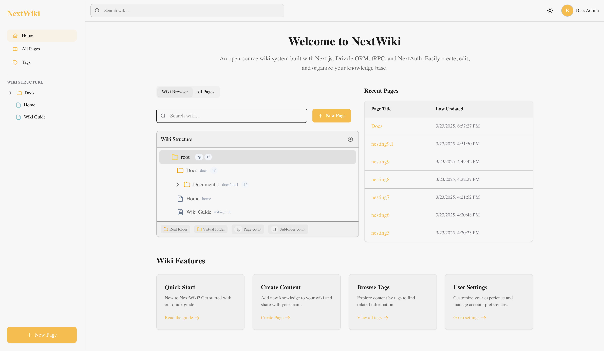
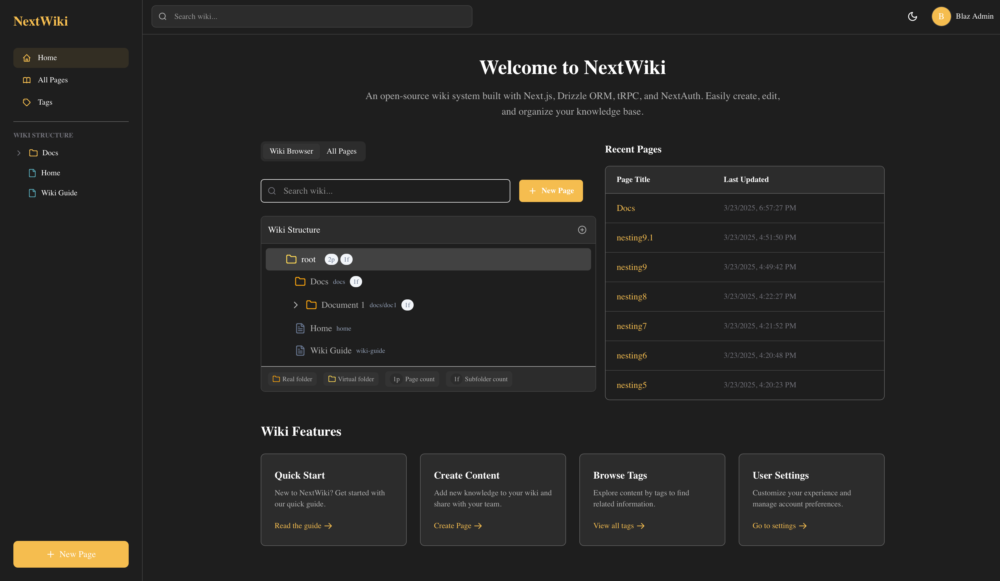
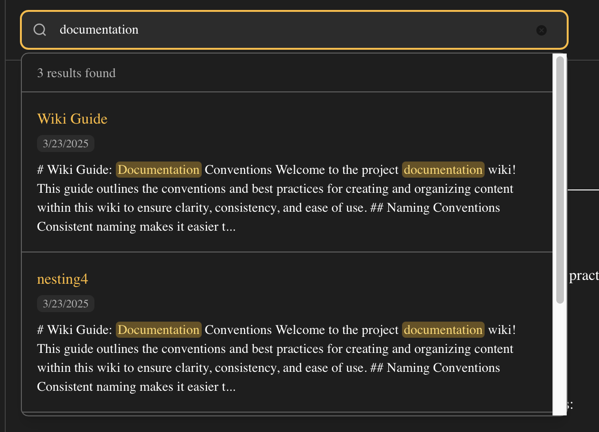
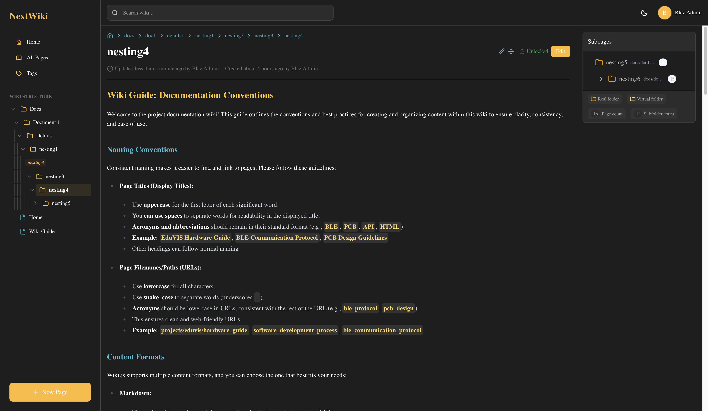
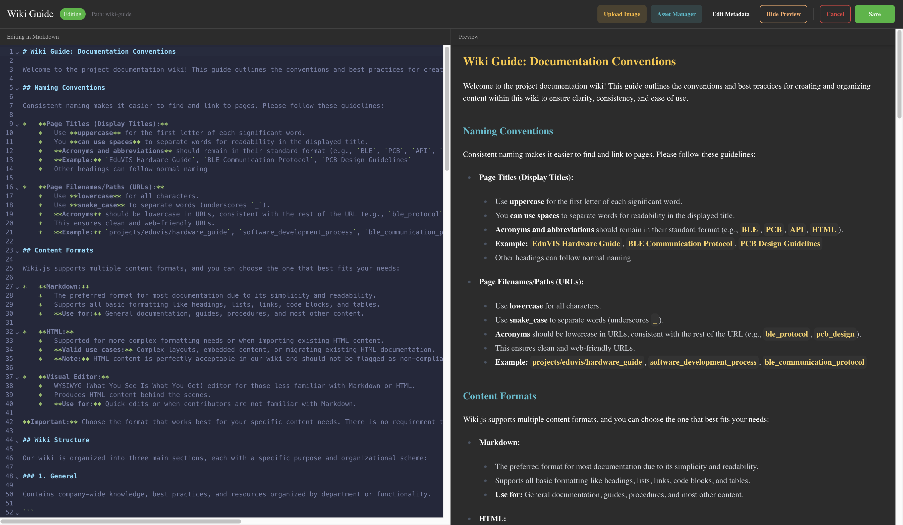
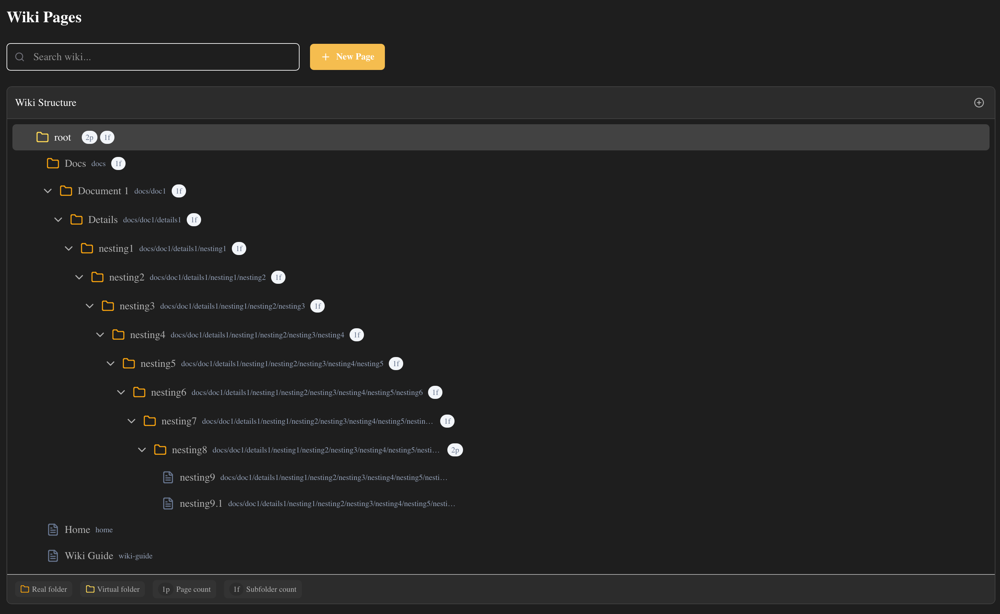
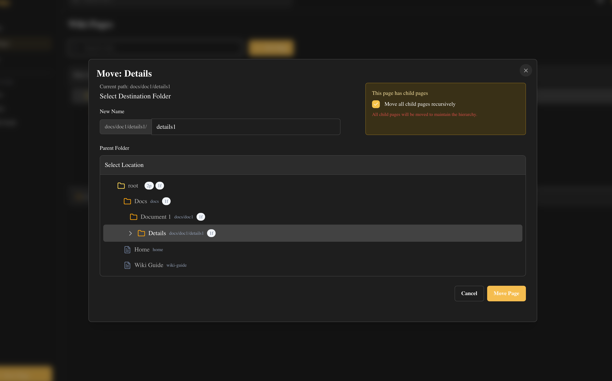

# NextWiki




An open-source wiki system built with modern web technologies, inspired by WikiJS. NextWiki provides a flexible, extensible platform for creating and managing knowledge bases.

## Features

- **Modern Stack**: Built with Next.js 15, React 19, Drizzle ORM, tRPC, NextAuth, Tailwind CSS, Codemirror, Shadcn UI, and more
- **Version History**: Track changes (in progress)
- **Markdown Support**: Write content using simple Markdown syntax
- **Direct Image Upload**: Upload images directly with paste or drag and drop
- **Syntax Highlighting**: Syntax highlighting for code blocks
- **Page/Folder Moving Functionality**: Move/rename pages and folders to different locations
- **Authentication**: Secure login with credentials or OAuth providers (only password login is implemented for now)
- **Advanced Search**: Full-text and fuzzy search
- **Tags & Categories**: Organize your content effectively (in progress)

## Tech Stack

- **Framework**: [Next.js](https://nextjs.org)
- **Database**: PostgreSQL with [Drizzle ORM](https://orm.drizzle.team)
- **API**: Type-safe APIs with [tRPC](https://trpc.io)
- **Authentication**: [NextAuth.js](https://next-auth.js.org)
- **Search**: PostgreSQL full-text search with trigram similarity for fuzzy matching
- **Styling**: Tailwind CSS
- **Deployment**: Compatible with Vercel, Netlify, or self-hosted

## Planned Features

- [ ] **Permissions**: Control who can view and edit content
- [ ] **Centralized settings**: Manage your wiki from a central settings page, with everything stored in the database
- [ ] **S3 Asset Storage**: Store assets in S3 or somewhere else
- [ ] **Tags & Categories**: Organize your content effectively
- [ ] **Better version history**: Track changes and revert to previous versions
- [ ] **Real-time Collaboration**: Multiple users can edit pages simultaneously
- [ ] **Typo tolerance**: Fuzzy search with typo tolerance
- [ ] **PDF Upload**: Upload PDFs to the wiki
- [ ] **Video Upload**: Upload videos to the wiki
- [ ] **Audio Upload**: Upload audio to the wiki

## Getting Started

### Prerequisites

- Node.js 18+ (pnpm recommended)
- PostgreSQL database (or Neon serverless PostgreSQL)

### Installation

1. Clone the repository:

   ```bash
   git clone https://github.com/barisgit/nextwiki.git
   cd nextwiki
   ```

2. Install dependencies:

   ```bash
   pnpm install
   ```

3. Copy the environment file and configure it:

   ```bash
   cp .env.example .env.local
   ```

   Update the values in `.env.local` with your database and authentication settings.

4. Set up the database:

   ```bash
   pnpm run db:setup     # Create the database in docker

   pnpm run db:generate  # Generate migrations
   pnpm run db:migrate   # Apply migrations
   ```

5. Start the development server:

   ```bash
   pnpm run dev
   ```

6. Open [http://localhost:3000](http://localhost:3000) in your browser to see the wiki.

## Search Features

NextWiki includes a powerful search system with several capabilities:

- **Full-text search**: Using PostgreSQL's tsvector/tsquery for efficient text search
- **Fuzzy matching**: Find content even when search terms have typos
- **Highlighted results**: Search results and matched terms are highlighted
- **Multi-layer approach**:
  1. Exact vector matching (highest relevance)
  2. Title matching (high relevance)
  3. Content matching (medium relevance)
  4. Similarity matching for typos (lower relevance) *(in progress)*

When a user clicks a search result, they'll be taken directly to the page with all instances of the search term highlighted, and the view will automatically scroll to the first match.

## Project Structure

```text
├── drizzle/             # Database migrations
├── public/              # Static assets
├── src/
│   ├── app/             # Next.js app router
│   ├── components/      # React components
│   │   ├── auth/        # Authentication components
│   │   ├── layout/      # Layout components
│   │   ├── ui/          # UI components
│   │   └── wiki/        # Wiki-specific components
│   ├── lib/             # Shared libraries
│   │   ├── db/          # Database connection and schema
│   │   ├── utils/       # Utility functions
│   │   ├── services/    # Database service functions (one layer above the drizzle layer)
│   │   └── trpc/        # tRPC routers and procedures
│   └── types/           # TypeScript type definitions
└── ... configuration files
```

## Screenshots











## Contributing

Contributions are welcome! Please feel free to submit a Pull Request. I would be grateful If anyone writes a guide on how to contribute to this project.

## License

This project is licensed under the MIT License - see the LICENSE file for details.
