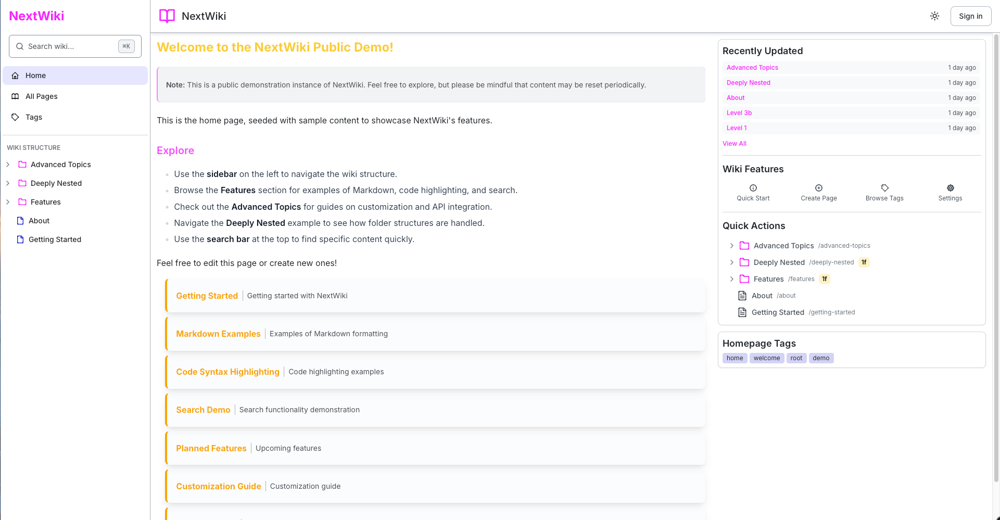
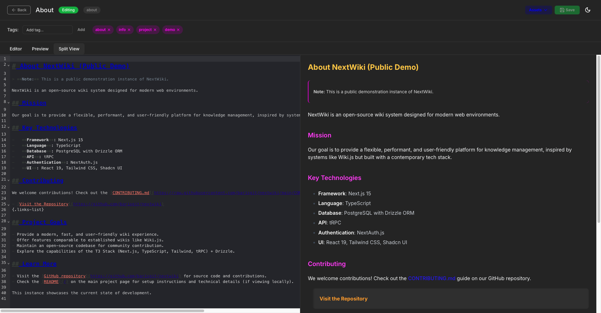

# NextWiki


<p align="center">
  <a href="https://next-wiki.com" target="_blank">
    
  </a>
</p>

[](https://opensource.org/licenses/MIT)

An open-source wiki system built with modern web technologies, inspired by WikiJS. NextWiki provides a flexible, extensible platform for creating and managing knowledge bases.

## 🚀 Features

- **Modern Stack**: Built with Next.js 15, React 19, Drizzle ORM, tRPC, NextAuth, Tailwind CSS, Codemirror, Shadcn UI, and more
- **Markdown Support**: Write content using simple Markdown syntax
- **Direct Image Upload**: Upload images directly with paste or drag and drop
- **Syntax Highlighting**: Syntax highlighting for code blocks
- **Page/Folder Moving Functionality**: Move/rename pages and folders to different locations
- **Authentication**: Secure login with credentials or OAuth providers (only password login is implemented for now)
- **Advanced Search**: Full-text and fuzzy search
- **Tags & Categories**: Organize your content effectively
- **Asset Manager**: Upload, delete, and manage assets (images, videos, PDFs, etc.)
- **Permissions**: Group and granular permission based access control
- **Settings**: Centralized settings for the wiki, manageable by the admin

## 🛠️ Tech Stack

- **Framework**: [Next.js](https://nextjs.org) (for the frontend and core features)
- **Backend**: Optional [NestJS](https://nestjs.com) on Fastify (for features like WebSockets, planned for Yjs integration)
- **Database**: PostgreSQL with [Drizzle ORM](https://orm.drizzle.team)
- **API**: Type-safe APIs with [tRPC](https://trpc.io) (primarily within Next.js)
- **Authentication**: [NextAuth.js](https://next-auth.js.org)
- **Search**: PostgreSQL full-text search with trigram similarity for fuzzy matching
- **Styling**: Tailwind CSS
- **Monorepo Management**: Turborepo
- **Deployment**: Compatible with Vercel, Netlify, or self-hosted (NestJS backend requires a Node.js environment)

*Note*: Most functionality resides within the Next.js application and can run on serverless platforms like Vercel. The NestJS backend is included to support optional self-hosted WebSocket functionality, anticipating future integration with Yjs for real-time collaboration, without relying on external providers.

## 🔮 Planned Features

- [ ] **S3 Asset Storage**: Store assets in S3 or somewhere else
- [ ] **Version history**: Track changes and revert to previous versions
- [ ] **Visual editor**: A visual editor for creating and editing pages
- [ ] **Real-time Collaboration**: Multiple users can edit pages simultaneously using Yjs
- [ ] **Better Settings**: Better settings, ability to manage authentication providers, etc.
- [ ] **Different theme support**: Ability to switch between different themes
- [ ] **Import/Export**: Ability to import and export pages from and to other wiki systems

## 📦 Getting Started

### Prerequisites

- Node.js 18+ (pnpm required)
- PostgreSQL database (or Neon serverless PostgreSQL)

### Installation

1. Clone the repository:

   ```bash
   git clone https://github.com/barisgit/nextwiki.git
   cd nextwiki
   ```

2. Install dependencies:

   ```bash
   pnpm install
   ```

3. Copy the environment file and configure it:

   ```bash
   cp apps/web/.env.example apps/web/.env
   cp packages/db/.env.example packages/db/.env
   ```

   Update the values in `.env` with your database and authentication settings.

4. Set up the database with one of the following commands:

   ```bash
   pnpm run db:setup     # Create the database in docker and seed it with example data

   pnpm run db:docker    # Just create the database in docker without seeding it
   ```

5. Start the development server:

   ```bash
   pnpm run dev:web
   pnpm run dev:backend
   ```

6. Open [http://localhost:3000](http://localhost:3000) in your browser to see the wiki.

## Search Features

NextWiki includes a powerful search system with several capabilities:

- **Full-text search**: Using PostgreSQL's tsvector/tsquery for efficient text search
- **Fuzzy matching**: Find content even when search terms have typos
- **Highlighted results**: Search results and matched terms are highlighted
- **Multi-layer approach**:
  1. Exact vector matching (highest relevance)
  2. Title matching (high relevance)
  3. Content matching (medium relevance)
  4. Similarity matching for typos (lower relevance)

When a user clicks a search result, they'll be taken directly to the page with all instances of the search term highlighted, and the view will automatically scroll to the first match.

## Project Structure

This project uses a Turborepo monorepo structure:

```text
├── apps/
│   ├── backend/         # Optional NestJS backend (Fastify)
│   └── web/             # Next.js frontend application
├── packages/
│   ├── auth/            # Authentication utilities (NextAuth)
│   ├── db/              # Drizzle ORM schema, migrations, and seeding
│   ├── eslint-config/   # Shared ESLint configuration
│   ├── logger/          # Shared logger configuration
│   ├── tailwind-config/ # Shared Tailwind CSS configuration
│   ├── types/           # Shared TypeScript types
│   ├── typescript-config/ # Shared TypeScript configuration
│   └── ui/              # Shared React UI components (Shadcn UI)
├── .github/             # GitHub Actions workflows
├── schema.dbml          # Database schema ER diagram
├── assets/              # Static assets like images for README
├── docs/                # Project documentation
└── ... configuration files (pnpm, turbo, prettier, etc.)
```

## Screenshots







## 🤝 Contributing

We welcome contributions! Please see our [CONTRIBUTING.md](./CONTRIBUTING.md) guide for details on how to get started. Even non-code contributions like documentation improvements, bug reports, and feature suggestions are appreciated!

## 📄 License

This project is licensed under the MIT License - see the [LICENSE](./LICENSE) file for details.

[](https://star-history.com/#barisgit/nextwiki&Date)
